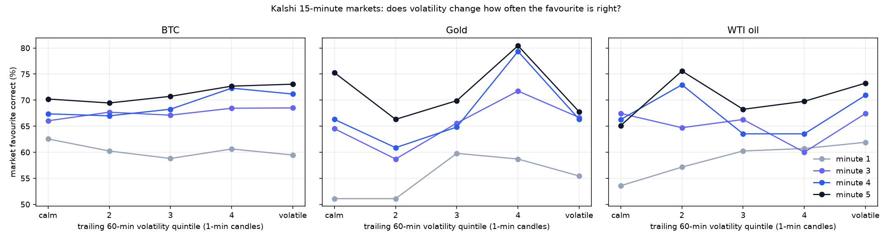

# Volatility vs. prediction accuracy — Kalshi 15-minute BTC, gold, WTI — 2026-10-03

Not pre-registered. Market = Kalshi's favourite at the mark; gap = spot vs. strike at the mark; volatility from the spot path known at the mark (bps per √min). CIs resample whole days.

## Summary: is higher volatility better or worse for the up/down call?

Logistic slope = change in log-odds of the market favourite being right per +1 SD of log volatility (1-minute candles, trailing 60 min). 'Beyond cushion' controls for how far price already is from the strike.

| asset | mark | windows | acc calm → volatile (quintile 1 → 5) | slope [95% CI] | beyond cushion [95% CI] | EV vs vol ρ [95% CI] | verdict |
|---|---|---|---|---|---|---|---|
| BTC | 1 | 2589 | 62.5% → 59.5% | -0.045 [-0.128, +0.037] | -0.034 [-0.121, +0.046] | -0.059 [-0.103, -0.019] | no clear effect |
| BTC | 3 | 2632 | 66.0% → 68.5% | +0.035 [-0.063, +0.133] | +0.037 [-0.062, +0.140] | -0.055 [-0.095, -0.011] | no clear effect |
| BTC | 4 | 2634 | 67.4% → 71.2% | +0.067 [-0.025, +0.183] | +0.080 [-0.015, +0.203] | -0.028 [-0.063, +0.016] | no clear effect |
| BTC | 5 | 2634 | 70.2% → 73.1% | +0.060 [-0.034, +0.176] | +0.048 [-0.045, +0.172] | -0.068 [-0.115, -0.012] | no clear effect |
| GOLD | 1 | 460 | 51.1% → 55.4% | +0.036 [-0.234, +0.299] | +0.055 [-0.184, +0.310] | +0.010 [-0.080, +0.111] | no clear effect |
| GOLD | 3 | 463 | 64.5% → 66.7% | +0.081 [-0.135, +0.273] | +0.102 [-0.132, +0.327] | -0.005 [-0.099, +0.089] | no clear effect |
| GOLD | 4 | 459 | 66.3% → 66.3% | +0.023 [-0.173, +0.242] | +0.063 [-0.148, +0.289] | -0.008 [-0.108, +0.074] | no clear effect |
| GOLD | 5 | 463 | 75.3% → 67.7% | -0.059 [-0.285, +0.126] | -0.004 [-0.245, +0.208] | -0.069 [-0.151, +0.014] | no clear effect |
| WTI | 1 | 419 | 53.6% → 61.9% | +0.171 [+0.085, +0.284] | +0.194 [+0.126, +0.290] | +0.030 [-0.032, +0.092] | higher vol → MORE accurate |
| WTI | 3 | 428 | 67.4% → 67.4% | +0.062 [-0.037, +0.161] | +0.052 [-0.095, +0.239] | -0.093 [-0.164, -0.017] | no clear effect |
| WTI | 4 | 427 | 66.3% → 70.9% | +0.060 [-0.072, +0.182] | +0.122 [-0.067, +0.345] | -0.015 [-0.110, +0.087] | no clear effect |
| WTI | 5 | 429 | 65.1% → 73.3% | +0.106 [-0.014, +0.241] | +0.122 [-0.001, +0.276] | -0.017 [-0.069, +0.050] | no clear effect |

## Pooled over marks 1, 3, 4, 5

Slope = change in log-odds that the market favourite is right per +1 SD of log volatility. 'rv_win' (volatility inside the window so far) looks strongly positive but vanishes once the cushion is controlled for: a window that has already moved a lot simply has a bigger gap, which is not independent information.

| asset | measure | windows×marks | slope [95% CI] | beyond cushion [95% CI] | EV vs vol ρ [95% CI] |
|---|---|---|---|---|---|
| BTC | rv1 | 10489 | +0.026 [-0.041, +0.109] | +0.031 [-0.038, +0.127] | -0.049 [-0.078, -0.011] |
| BTC | rv3 | 10489 | +0.039 [-0.026, +0.117] | +0.029 [-0.034, +0.114] | -0.061 [-0.088, -0.024] |
| BTC | rv4 | 10489 | +0.040 [-0.024, +0.124] | +0.024 [-0.040, +0.110] | -0.064 [-0.093, -0.031] |
| BTC | rv5 | 10489 | +0.057 [-0.001, +0.135] | +0.033 [-0.022, +0.115] | -0.067 [-0.094, -0.033] |
| BTC | rv_win | 10489 | +0.206 [+0.139, +0.297] | +0.024 [-0.033, +0.101] | -0.154 [-0.180, -0.127] |
| GOLD | rv1 | 1845 | +0.023 [-0.163, +0.208] | +0.058 [-0.147, +0.278] | -0.014 [-0.097, +0.076] |
| GOLD | rv3 | 1845 | +0.078 [-0.086, +0.254] | +0.085 [-0.096, +0.287] | -0.014 [-0.086, +0.065] |
| GOLD | rv4 | 1845 | +0.072 [-0.110, +0.259] | +0.072 [-0.131, +0.270] | -0.022 [-0.103, +0.066] |
| GOLD | rv5 | 1845 | +0.046 [-0.156, +0.210] | +0.031 [-0.188, +0.204] | -0.049 [-0.144, +0.029] |
| GOLD | rv_win | 1845 | +0.352 [+0.180, +0.558] | +0.100 [-0.099, +0.321] | -0.142 [-0.233, -0.050] |
| WTI | rv1 | 1703 | +0.099 [+0.033, +0.177] | +0.124 [+0.024, +0.231] | -0.018 [-0.066, +0.033] |
| WTI | rv3 | 1703 | +0.108 [+0.022, +0.201] | +0.107 [-0.014, +0.229] | -0.033 [-0.081, +0.016] |
| WTI | rv4 | 1703 | +0.126 [+0.057, +0.201] | +0.121 [+0.032, +0.220] | -0.029 [-0.063, +0.003] |
| WTI | rv5 | 1703 | +0.097 [+0.031, +0.178] | +0.077 [-0.018, +0.179] | -0.054 [-0.087, -0.019] |
| WTI | rv_win | 1703 | +0.354 [+0.223, +0.486] | +0.076 [-0.074, +0.189] | -0.132 [-0.186, -0.083] |

All three assets together (1-minute-candle volatility z-scored within asset), 14037 observations: slope +0.034 [-0.028, +0.095].

Buying the market favourite at the ask, by volatility tercile (all assets):

| volatility | n | favourite correct | avg ask | EV per contract after fee |
|---|---|---|---|---|
| calm | 4679 | 65.1% | 0.647 | -1.52¢ |
| middle | 4679 | 67.4% | 0.660 | -0.58¢ |
| volatile | 4679 | 67.5% | 0.673 | -1.72¢ |

### BTC · minute 1 · 2589 windows, 29 days

Quintiles of 1-minute-candle volatility (trailing 60 min):

| quintile | n | median vol bps/√min | market correct [95% CI] | gap correct | Brier market | Brier cushion | EV fav @ ask | median cushion |z| |
|---|---|---|---|---|---|---|---|---|
| 1 | 518 | 1.99 | 62.5% [58%–67%] | 61.8% | 0.2283 | 0.2298 | +1.9¢ | 0.21 |
| 2 | 518 | 3.00 | 60.2% [56%–64%] | 58.1% | 0.2353 | 0.2390 | -1.7¢ | 0.22 |
| 3 | 517 | 3.85 | 58.8% [55%–63%] | 60.3% | 0.2371 | 0.2367 | -3.1¢ | 0.21 |
| 4 | 518 | 4.72 | 60.6% [56%–65%] | 62.4% | 0.2291 | 0.2321 | -1.6¢ | 0.21 |
| 5 | 518 | 7.13 | 59.5% [55%–64%] | 59.1% | 0.2371 | 0.2398 | -3.4¢ | 0.19 |

Each volatility measure:

| measure | ρ(vol, correct) [95% CI] | slope [95% CI] | beyond cushion [95% CI] | top − bottom quintile |
|---|---|---|---|---|
| rv1 | +0.043 [-0.121, +0.074] | -0.045 [-0.128, +0.037] | -0.034 [-0.121, +0.046] | -3.1 pts |
| rv3 | +0.032 [-0.115, +0.073] | -0.040 [-0.126, +0.038] | -0.034 [-0.115, +0.044] | -1.7 pts |
| rv4 | +0.027 [-0.116, +0.068] | -0.061 [-0.138, +0.018] | -0.054 [-0.138, +0.024] | -4.2 pts |
| rv5 | +0.025 [-0.111, +0.075] | -0.039 [-0.115, +0.047] | -0.032 [-0.107, +0.056] | -1.5 pts |
| rv_win | +0.110 [+0.021, +0.136] | +0.158 [+0.082, +0.245] | +0.042 [-0.032, +0.134] | +13.5 pts |

How the volatility measures agree (Spearman):

| | rv1 | rv3 | rv4 | rv5 | rv_win |
|---|---|---|---|---|---|
| rv1 | 1.00 | 0.94 | 0.93 | 0.91 | 0.42 |
| rv3 | 0.94 | 1.00 | 0.94 | 0.93 | 0.41 |
| rv4 | 0.93 | 0.94 | 1.00 | 0.92 | 0.40 |
| rv5 | 0.91 | 0.93 | 0.92 | 1.00 | 0.39 |
| rv_win | 0.42 | 0.41 | 0.40 | 0.39 | 1.00 |

### BTC · minute 3 · 2632 windows, 29 days

Quintiles of 1-minute-candle volatility (trailing 60 min):

| quintile | n | median vol bps/√min | market correct [95% CI] | gap correct | Brier market | Brier cushion | EV fav @ ask | median cushion |z| |
|---|---|---|---|---|---|---|---|---|
| 1 | 527 | 1.96 | 66.0% [62%–70%] | 67.4% | 0.2138 | 0.2161 | +0.6¢ | 0.36 |
| 2 | 526 | 2.97 | 67.7% [64%–72%] | 63.9% | 0.2155 | 0.2156 | +0.8¢ | 0.38 |
| 3 | 526 | 3.80 | 67.1% [63%–71%] | 66.9% | 0.2092 | 0.2130 | -1.0¢ | 0.40 |
| 4 | 526 | 4.70 | 68.4% [64%–72%] | 67.9% | 0.2038 | 0.2059 | +0.8¢ | 0.35 |
| 5 | 527 | 7.06 | 68.5% [64%–72%] | 70.2% | 0.2074 | 0.2097 | -0.8¢ | 0.35 |

Each volatility measure:

| measure | ρ(vol, correct) [95% CI] | slope [95% CI] | beyond cushion [95% CI] | top − bottom quintile |
|---|---|---|---|---|
| rv1 | +0.088 [-0.102, +0.113] | +0.035 [-0.063, +0.133] | +0.037 [-0.062, +0.140] | +2.5 pts |
| rv3 | +0.088 [-0.088, +0.121] | +0.071 [-0.019, +0.159] | +0.055 [-0.036, +0.145] | +4.7 pts |
| rv4 | +0.081 [-0.092, +0.114] | +0.057 [-0.030, +0.141] | +0.033 [-0.045, +0.118] | +3.0 pts |
| rv5 | +0.096 [-0.079, +0.117] | +0.078 [-0.003, +0.160] | +0.055 [-0.027, +0.138] | +4.4 pts |
| rv_win | +0.134 [+0.003, +0.157] | +0.193 [+0.097, +0.306] | +0.037 [-0.057, +0.134] | +14.2 pts |

How the volatility measures agree (Spearman):

| | rv1 | rv3 | rv4 | rv5 | rv_win |
|---|---|---|---|---|---|
| rv1 | 1.00 | 0.95 | 0.92 | 0.90 | 0.64 |
| rv3 | 0.95 | 1.00 | 0.94 | 0.92 | 0.62 |
| rv4 | 0.92 | 0.94 | 1.00 | 0.92 | 0.62 |
| rv5 | 0.90 | 0.92 | 0.92 | 1.00 | 0.60 |
| rv_win | 0.64 | 0.62 | 0.62 | 0.60 | 1.00 |

### BTC · minute 4 · 2634 windows, 29 days

Quintiles of 1-minute-candle volatility (trailing 60 min):

| quintile | n | median vol bps/√min | market correct [95% CI] | gap correct | Brier market | Brier cushion | EV fav @ ask | median cushion |z| |
|---|---|---|---|---|---|---|---|---|
| 1 | 527 | 1.95 | 67.4% [63%–71%] | 67.0% | 0.2041 | 0.2064 | -0.2¢ | 0.42 |
| 2 | 527 | 2.96 | 67.0% [63%–71%] | 66.4% | 0.2096 | 0.2109 | -1.9¢ | 0.41 |
| 3 | 526 | 3.81 | 68.3% [64%–72%] | 66.5% | 0.2002 | 0.2036 | -1.6¢ | 0.46 |
| 4 | 527 | 4.71 | 72.3% [68%–76%] | 72.3% | 0.1890 | 0.1908 | +2.7¢ | 0.40 |
| 5 | 527 | 7.08 | 71.2% [67%–75%] | 70.6% | 0.1938 | 0.1959 | -0.4¢ | 0.40 |

Each volatility measure:

| measure | ρ(vol, correct) [95% CI] | slope [95% CI] | beyond cushion [95% CI] | top − bottom quintile |
|---|---|---|---|---|
| rv1 | +0.073 [-0.096, +0.136] | +0.067 [-0.025, +0.183] | +0.080 [-0.015, +0.203] | +3.8 pts |
| rv3 | +0.071 [-0.091, +0.137] | +0.084 [-0.003, +0.195] | +0.078 [-0.011, +0.200] | +5.7 pts |
| rv4 | +0.075 [-0.078, +0.143] | +0.100 [+0.021, +0.214] | +0.083 [+0.002, +0.196] | +6.8 pts |
| rv5 | +0.073 [-0.080, +0.139] | +0.108 [+0.021, +0.214] | +0.083 [-0.001, +0.190] | +6.3 pts |
| rv_win | +0.115 [-0.009, +0.171] | +0.206 [+0.100, +0.331] | +0.035 [-0.048, +0.152] | +15.7 pts |

How the volatility measures agree (Spearman):

| | rv1 | rv3 | rv4 | rv5 | rv_win |
|---|---|---|---|---|---|
| rv1 | 1.00 | 0.95 | 0.93 | 0.90 | 0.69 |
| rv3 | 0.95 | 1.00 | 0.94 | 0.93 | 0.66 |
| rv4 | 0.93 | 0.94 | 1.00 | 0.92 | 0.65 |
| rv5 | 0.90 | 0.93 | 0.92 | 1.00 | 0.64 |
| rv_win | 0.69 | 0.66 | 0.65 | 0.64 | 1.00 |

### BTC · minute 5 · 2634 windows, 29 days

Quintiles of 1-minute-candle volatility (trailing 60 min):

| quintile | n | median vol bps/√min | market correct [95% CI] | gap correct | Brier market | Brier cushion | EV fav @ ask | median cushion |z| |
|---|---|---|---|---|---|---|---|---|
| 1 | 527 | 1.96 | 70.2% [66%–74%] | 69.4% | 0.1974 | 0.2004 | +1.3¢ | 0.45 |
| 2 | 527 | 2.96 | 69.4% [65%–73%] | 68.9% | 0.1999 | 0.2010 | -1.2¢ | 0.47 |
| 3 | 526 | 3.81 | 70.7% [67%–74%] | 69.2% | 0.1910 | 0.1947 | -1.3¢ | 0.50 |
| 4 | 527 | 4.69 | 72.7% [69%–76%] | 72.3% | 0.1794 | 0.1807 | +0.5¢ | 0.49 |
| 5 | 527 | 7.09 | 73.1% [69%–77%] | 72.5% | 0.1835 | 0.1849 | -1.2¢ | 0.48 |

Each volatility measure:

| measure | ρ(vol, correct) [95% CI] | slope [95% CI] | beyond cushion [95% CI] | top − bottom quintile |
|---|---|---|---|---|
| rv1 | +0.038 [-0.109, +0.145] | +0.060 [-0.034, +0.176] | +0.048 [-0.045, +0.172] | +2.8 pts |
| rv3 | +0.034 [-0.110, +0.149] | +0.056 [-0.018, +0.163] | +0.024 [-0.053, +0.139] | +2.5 pts |
| rv4 | +0.046 [-0.097, +0.151] | +0.081 [+0.004, +0.193] | +0.043 [-0.038, +0.161] | +1.1 pts |
| rv5 | +0.045 [-0.091, +0.157] | +0.090 [+0.020, +0.202] | +0.033 [-0.039, +0.143] | +5.1 pts |
| rv_win | +0.079 [-0.034, +0.171] | +0.196 [+0.100, +0.318] | +0.014 [-0.077, +0.130] | +12.3 pts |

How the volatility measures agree (Spearman):

| | rv1 | rv3 | rv4 | rv5 | rv_win |
|---|---|---|---|---|---|
| rv1 | 1.00 | 0.94 | 0.93 | 0.91 | 0.72 |
| rv3 | 0.94 | 1.00 | 0.94 | 0.92 | 0.69 |
| rv4 | 0.93 | 0.94 | 1.00 | 0.92 | 0.68 |
| rv5 | 0.91 | 0.92 | 0.92 | 1.00 | 0.67 |
| rv_win | 0.72 | 0.69 | 0.68 | 0.67 | 1.00 |

### GOLD · minute 1 · 460 windows, 7 days

Quintiles of 1-minute-candle volatility (trailing 60 min):

| quintile | n | median vol bps/√min | market correct [95% CI] | gap correct | Brier market | Brier cushion | EV fav @ ask | median cushion |z| |
|---|---|---|---|---|---|---|---|---|
| 1 | 92 | 2.14 | 51.1% [41%–61%] | 51.1% | 0.2555 | 0.2538 | -10.8¢ | 0.20 |
| 2 | 92 | 2.57 | 51.1% [41%–61%] | 52.2% | 0.2530 | 0.2543 | -10.5¢ | 0.20 |
| 3 | 92 | 3.09 | 59.8% [50%–69%] | 63.0% | 0.2205 | 0.2246 | -1.9¢ | 0.17 |
| 4 | 92 | 3.74 | 58.7% [48%–68%] | 56.5% | 0.2373 | 0.2385 | -4.3¢ | 0.23 |
| 5 | 92 | 5.29 | 55.4% [45%–65%] | 53.3% | 0.2367 | 0.2355 | -7.1¢ | 0.19 |

Each volatility measure:

| measure | ρ(vol, correct) [95% CI] | slope [95% CI] | beyond cushion [95% CI] | top − bottom quintile |
|---|---|---|---|---|
| rv1 | +0.015 [-0.097, +0.155] | +0.036 [-0.234, +0.299] | +0.055 [-0.184, +0.310] | +4.3 pts |
| rv3 | +0.024 [-0.097, +0.167] | +0.098 [-0.172, +0.365] | +0.119 [-0.103, +0.366] | +9.8 pts |
| rv4 | +0.018 [-0.089, +0.142] | +0.092 [-0.180, +0.332] | +0.103 [-0.142, +0.325] | +6.5 pts |
| rv5 | -0.041 [-0.131, +0.107] | +0.005 [-0.260, +0.250] | +0.015 [-0.232, +0.236] | +2.2 pts |
| rv_win | +0.135 [+0.078, +0.270] | +0.429 [+0.215, +0.645] | +0.291 [-0.075, +0.666] | +25.0 pts |

How the volatility measures agree (Spearman):

| | rv1 | rv3 | rv4 | rv5 | rv_win |
|---|---|---|---|---|---|
| rv1 | 1.00 | 0.90 | 0.85 | 0.81 | 0.31 |
| rv3 | 0.90 | 1.00 | 0.89 | 0.88 | 0.28 |
| rv4 | 0.85 | 0.89 | 1.00 | 0.87 | 0.28 |
| rv5 | 0.81 | 0.88 | 0.87 | 1.00 | 0.26 |
| rv_win | 0.31 | 0.28 | 0.28 | 0.26 | 1.00 |

### GOLD · minute 3 · 463 windows, 7 days

Quintiles of 1-minute-candle volatility (trailing 60 min):

| quintile | n | median vol bps/√min | market correct [95% CI] | gap correct | Brier market | Brier cushion | EV fav @ ask | median cushion |z| |
|---|---|---|---|---|---|---|---|---|
| 1 | 93 | 2.13 | 64.5% [54%–73%] | 64.5% | 0.2256 | 0.2234 | -1.0¢ | 0.29 |
| 2 | 92 | 2.59 | 58.7% [48%–68%] | 56.5% | 0.2590 | 0.2628 | -10.8¢ | 0.40 |
| 3 | 93 | 3.09 | 65.6% [55%–74%] | 62.4% | 0.2119 | 0.2134 | -1.0¢ | 0.30 |
| 4 | 92 | 3.77 | 71.7% [62%–80%] | 73.9% | 0.1947 | 0.1919 | +2.0¢ | 0.37 |
| 5 | 93 | 5.32 | 66.7% [57%–75%] | 66.7% | 0.2062 | 0.2058 | -1.5¢ | 0.29 |

Each volatility measure:

| measure | ρ(vol, correct) [95% CI] | slope [95% CI] | beyond cushion [95% CI] | top − bottom quintile |
|---|---|---|---|---|
| rv1 | +0.014 [-0.082, +0.162] | +0.081 [-0.135, +0.273] | +0.102 [-0.132, +0.327] | +2.2 pts |
| rv3 | +0.044 [-0.049, +0.160] | +0.129 [-0.078, +0.315] | +0.122 [-0.087, +0.310] | +11.8 pts |
| rv4 | +0.047 [-0.053, +0.180] | +0.176 [-0.031, +0.346] | +0.167 [-0.054, +0.360] | +10.8 pts |
| rv5 | +0.036 [-0.052, +0.160] | +0.119 [-0.121, +0.280] | +0.107 [-0.140, +0.281] | +4.3 pts |
| rv_win | +0.109 [-0.005, +0.246] | +0.346 [+0.070, +0.640] | +0.193 [-0.151, +0.545] | +17.2 pts |

How the volatility measures agree (Spearman):

| | rv1 | rv3 | rv4 | rv5 | rv_win |
|---|---|---|---|---|---|
| rv1 | 1.00 | 0.89 | 0.85 | 0.80 | 0.48 |
| rv3 | 0.89 | 1.00 | 0.89 | 0.86 | 0.45 |
| rv4 | 0.85 | 0.89 | 1.00 | 0.87 | 0.44 |
| rv5 | 0.80 | 0.86 | 0.87 | 1.00 | 0.41 |
| rv_win | 0.48 | 0.45 | 0.44 | 0.41 | 1.00 |

### GOLD · minute 4 · 459 windows, 7 days

Quintiles of 1-minute-candle volatility (trailing 60 min):

| quintile | n | median vol bps/√min | market correct [95% CI] | gap correct | Brier market | Brier cushion | EV fav @ ask | median cushion |z| |
|---|---|---|---|---|---|---|---|---|
| 1 | 92 | 2.10 | 66.3% [56%–75%] | 68.5% | 0.2148 | 0.2074 | -2.2¢ | 0.39 |
| 2 | 92 | 2.58 | 60.9% [51%–70%] | 60.9% | 0.2448 | 0.2484 | -11.0¢ | 0.50 |
| 3 | 91 | 3.10 | 64.8% [55%–74%] | 62.6% | 0.2084 | 0.2077 | -4.6¢ | 0.41 |
| 4 | 92 | 3.77 | 79.3% [70%–86%] | 79.3% | 0.1678 | 0.1682 | +7.6¢ | 0.45 |
| 5 | 92 | 5.35 | 66.3% [56%–75%] | 65.2% | 0.2121 | 0.2085 | -4.4¢ | 0.32 |

Each volatility measure:

| measure | ρ(vol, correct) [95% CI] | slope [95% CI] | beyond cushion [95% CI] | top − bottom quintile |
|---|---|---|---|---|
| rv1 | -0.001 [-0.085, +0.163] | +0.023 [-0.173, +0.242] | +0.063 [-0.148, +0.289] | +0.0 pts |
| rv3 | +0.006 [-0.070, +0.152] | +0.048 [-0.114, +0.274] | +0.059 [-0.128, +0.287] | +0.0 pts |
| rv4 | +0.025 [-0.063, +0.175] | +0.088 [-0.083, +0.340] | +0.081 [-0.103, +0.318] | +6.5 pts |
| rv5 | +0.028 [-0.068, +0.156] | +0.078 [-0.102, +0.297] | +0.059 [-0.153, +0.283] | -1.1 pts |
| rv_win | +0.052 [-0.026, +0.208] | +0.289 [-0.005, +0.541] | +0.094 [-0.280, +0.400] | +13.0 pts |

How the volatility measures agree (Spearman):

| | rv1 | rv3 | rv4 | rv5 | rv_win |
|---|---|---|---|---|---|
| rv1 | 1.00 | 0.91 | 0.85 | 0.82 | 0.52 |
| rv3 | 0.91 | 1.00 | 0.90 | 0.88 | 0.47 |
| rv4 | 0.85 | 0.90 | 1.00 | 0.90 | 0.45 |
| rv5 | 0.82 | 0.88 | 0.90 | 1.00 | 0.45 |
| rv_win | 0.52 | 0.47 | 0.45 | 0.45 | 1.00 |

### GOLD · minute 5 · 463 windows, 7 days

Quintiles of 1-minute-candle volatility (trailing 60 min):

| quintile | n | median vol bps/√min | market correct [95% CI] | gap correct | Brier market | Brier cushion | EV fav @ ask | median cushion |z| |
|---|---|---|---|---|---|---|---|---|
| 1 | 93 | 2.11 | 75.3% [66%–83%] | 74.2% | 0.1819 | 0.1736 | +4.1¢ | 0.50 |
| 2 | 92 | 2.60 | 66.3% [56%–75%] | 65.2% | 0.2173 | 0.2213 | -4.8¢ | 0.42 |
| 3 | 93 | 3.11 | 69.9% [60%–78%] | 66.7% | 0.1965 | 0.1931 | -4.1¢ | 0.58 |
| 4 | 92 | 3.78 | 80.4% [71%–87%] | 78.3% | 0.1554 | 0.1559 | +5.5¢ | 0.56 |
| 5 | 93 | 5.28 | 67.7% [58%–76%] | 67.7% | 0.1947 | 0.1959 | -5.5¢ | 0.41 |

Each volatility measure:

| measure | ρ(vol, correct) [95% CI] | slope [95% CI] | beyond cushion [95% CI] | top − bottom quintile |
|---|---|---|---|---|
| rv1 | -0.049 [-0.130, +0.128] | -0.059 [-0.285, +0.126] | -0.004 [-0.245, +0.208] | -7.5 pts |
| rv3 | +0.014 [-0.105, +0.141] | +0.012 [-0.160, +0.197] | +0.023 [-0.157, +0.217] | -2.2 pts |
| rv4 | -0.034 [-0.121, +0.102] | -0.071 [-0.352, +0.148] | -0.076 [-0.374, +0.160] | -3.2 pts |
| rv5 | -0.049 [-0.115, +0.103] | -0.036 [-0.269, +0.153] | -0.071 [-0.320, +0.106] | -5.4 pts |
| rv_win | +0.000 [-0.064, +0.168] | +0.085 [-0.143, +0.342] | -0.118 [-0.343, +0.129] | +2.2 pts |

How the volatility measures agree (Spearman):

| | rv1 | rv3 | rv4 | rv5 | rv_win |
|---|---|---|---|---|---|
| rv1 | 1.00 | 0.92 | 0.86 | 0.83 | 0.57 |
| rv3 | 0.92 | 1.00 | 0.90 | 0.87 | 0.55 |
| rv4 | 0.86 | 0.90 | 1.00 | 0.87 | 0.50 |
| rv5 | 0.83 | 0.87 | 0.87 | 1.00 | 0.47 |
| rv_win | 0.57 | 0.55 | 0.50 | 0.47 | 1.00 |

### WTI · minute 1 · 419 windows, 7 days

Quintiles of 1-minute-candle volatility (trailing 60 min):

| quintile | n | median vol bps/√min | market correct [95% CI] | gap correct | Brier market | Brier cushion | EV fav @ ask | median cushion |z| |
|---|---|---|---|---|---|---|---|---|
| 1 | 84 | 4.90 | 53.6% [43%–64%] | 54.8% | 0.2428 | 0.2390 | -8.9¢ | 0.20 |
| 2 | 84 | 6.21 | 57.1% [46%–67%] | 58.3% | 0.2308 | 0.2317 | -4.9¢ | 0.20 |
| 3 | 83 | 7.83 | 60.2% [49%–70%] | 59.0% | 0.2417 | 0.2398 | -3.2¢ | 0.22 |
| 4 | 84 | 9.38 | 60.7% [50%–70%] | 60.7% | 0.2426 | 0.2412 | -3.4¢ | 0.25 |
| 5 | 84 | 12.93 | 61.9% [51%–72%] | 61.9% | 0.2258 | 0.2285 | -1.1¢ | 0.17 |

Each volatility measure:

| measure | ρ(vol, correct) [95% CI] | slope [95% CI] | beyond cushion [95% CI] | top − bottom quintile |
|---|---|---|---|---|
| rv1 | +0.012 [-0.034, +0.140] | +0.171 [+0.085, +0.284] | +0.194 [+0.126, +0.290] | +8.3 pts |
| rv3 | +0.017 [-0.038, +0.119] | +0.163 [+0.110, +0.226] | +0.181 [+0.125, +0.236] | +11.9 pts |
| rv4 | +0.046 [-0.026, +0.132] | +0.190 [+0.121, +0.260] | +0.220 [+0.152, +0.282] | +16.7 pts |
| rv5 | +0.039 [-0.057, +0.114] | +0.133 [+0.055, +0.203] | +0.161 [+0.080, +0.213] | +11.9 pts |
| rv_win | +0.143 [+0.046, +0.196] | +0.307 [+0.173, +0.420] | +0.052 [-0.136, +0.164] | +20.2 pts |

How the volatility measures agree (Spearman):

| | rv1 | rv3 | rv4 | rv5 | rv_win |
|---|---|---|---|---|---|
| rv1 | 1.00 | 0.93 | 0.89 | 0.85 | 0.35 |
| rv3 | 0.93 | 1.00 | 0.90 | 0.88 | 0.34 |
| rv4 | 0.89 | 0.90 | 1.00 | 0.87 | 0.29 |
| rv5 | 0.85 | 0.88 | 0.87 | 1.00 | 0.31 |
| rv_win | 0.35 | 0.34 | 0.29 | 0.31 | 1.00 |

### WTI · minute 3 · 428 windows, 7 days

Quintiles of 1-minute-candle volatility (trailing 60 min):

| quintile | n | median vol bps/√min | market correct [95% CI] | gap correct | Brier market | Brier cushion | EV fav @ ask | median cushion |z| |
|---|---|---|---|---|---|---|---|---|
| 1 | 86 | 4.80 | 67.4% [57%–76%] | 64.0% | 0.2189 | 0.2220 | +1.4¢ | 0.31 |
| 2 | 85 | 6.12 | 64.7% [54%–74%] | 63.5% | 0.2012 | 0.1967 | -3.2¢ | 0.32 |
| 3 | 86 | 7.85 | 66.3% [56%–75%] | 65.1% | 0.2076 | 0.2063 | -1.7¢ | 0.30 |
| 4 | 85 | 9.34 | 60.0% [49%–70%] | 60.0% | 0.2393 | 0.2439 | -10.2¢ | 0.34 |
| 5 | 86 | 12.79 | 67.4% [57%–76%] | 69.8% | 0.1903 | 0.1954 | -3.1¢ | 0.33 |

Each volatility measure:

| measure | ρ(vol, correct) [95% CI] | slope [95% CI] | beyond cushion [95% CI] | top − bottom quintile |
|---|---|---|---|---|
| rv1 | +0.048 [-0.116, +0.080] | +0.062 [-0.037, +0.161] | +0.052 [-0.095, +0.239] | +0.0 pts |
| rv3 | +0.083 [-0.062, +0.121] | +0.127 [+0.019, +0.246] | +0.091 [-0.050, +0.290] | +10.5 pts |
| rv4 | +0.057 [-0.076, +0.104] | +0.100 [-0.021, +0.275] | +0.057 [-0.094, +0.296] | +7.0 pts |
| rv5 | +0.080 [-0.076, +0.118] | +0.106 [-0.027, +0.250] | +0.081 [-0.076, +0.290] | +5.8 pts |
| rv_win | +0.182 [+0.005, +0.202] | +0.315 [+0.108, +0.562] | +0.027 [-0.221, +0.241] | +26.7 pts |

How the volatility measures agree (Spearman):

| | rv1 | rv3 | rv4 | rv5 | rv_win |
|---|---|---|---|---|---|
| rv1 | 1.00 | 0.92 | 0.88 | 0.85 | 0.55 |
| rv3 | 0.92 | 1.00 | 0.90 | 0.89 | 0.53 |
| rv4 | 0.88 | 0.90 | 1.00 | 0.88 | 0.52 |
| rv5 | 0.85 | 0.89 | 0.88 | 1.00 | 0.47 |
| rv_win | 0.55 | 0.53 | 0.52 | 0.47 | 1.00 |

### WTI · minute 4 · 427 windows, 7 days

Quintiles of 1-minute-candle volatility (trailing 60 min):

| quintile | n | median vol bps/√min | market correct [95% CI] | gap correct | Brier market | Brier cushion | EV fav @ ask | median cushion |z| |
|---|---|---|---|---|---|---|---|---|
| 1 | 86 | 4.85 | 66.3% [56%–75%] | 64.0% | 0.2146 | 0.2196 | -5.1¢ | 0.45 |
| 2 | 85 | 6.18 | 72.9% [63%–81%] | 70.6% | 0.1862 | 0.1847 | +3.2¢ | 0.35 |
| 3 | 85 | 7.87 | 63.5% [53%–73%] | 64.7% | 0.2074 | 0.2059 | -7.8¢ | 0.42 |
| 4 | 85 | 9.38 | 63.5% [53%–73%] | 63.5% | 0.2105 | 0.2115 | -9.0¢ | 0.43 |
| 5 | 86 | 12.82 | 70.9% [61%–79%] | 72.1% | 0.1981 | 0.2009 | -0.8¢ | 0.36 |

Each volatility measure:

| measure | ρ(vol, correct) [95% CI] | slope [95% CI] | beyond cushion [95% CI] | top − bottom quintile |
|---|---|---|---|---|
| rv1 | -0.061 [-0.114, +0.111] | +0.060 [-0.072, +0.182] | +0.122 [-0.067, +0.345] | +4.7 pts |
| rv3 | -0.076 [-0.133, +0.096] | +0.023 [-0.131, +0.176] | +0.051 [-0.149, +0.260] | +5.8 pts |
| rv4 | -0.046 [-0.088, +0.092] | +0.077 [-0.037, +0.186] | +0.087 [-0.068, +0.260] | +7.0 pts |
| rv5 | -0.075 [-0.117, +0.079] | +0.008 [-0.125, +0.155] | -0.013 [-0.183, +0.185] | -3.5 pts |
| rv_win | +0.087 [+0.017, +0.221] | +0.366 [+0.138, +0.669] | +0.152 [-0.105, +0.524] | +24.4 pts |

How the volatility measures agree (Spearman):

| | rv1 | rv3 | rv4 | rv5 | rv_win |
|---|---|---|---|---|---|
| rv1 | 1.00 | 0.92 | 0.88 | 0.84 | 0.60 |
| rv3 | 0.92 | 1.00 | 0.89 | 0.88 | 0.56 |
| rv4 | 0.88 | 0.89 | 1.00 | 0.88 | 0.54 |
| rv5 | 0.84 | 0.88 | 0.88 | 1.00 | 0.52 |
| rv_win | 0.60 | 0.56 | 0.54 | 0.52 | 1.00 |

### WTI · minute 5 · 429 windows, 7 days

Quintiles of 1-minute-candle volatility (trailing 60 min):

| quintile | n | median vol bps/√min | market correct [95% CI] | gap correct | Brier market | Brier cushion | EV fav @ ask | median cushion |z| |
|---|---|---|---|---|---|---|---|---|
| 1 | 86 | 4.73 | 65.1% [55%–74%] | 61.6% | 0.2158 | 0.2192 | -6.1¢ | 0.42 |
| 2 | 86 | 6.19 | 75.6% [66%–83%] | 74.4% | 0.1807 | 0.1803 | +2.7¢ | 0.48 |
| 3 | 85 | 7.82 | 68.2% [58%–77%] | 67.1% | 0.1829 | 0.1835 | -5.7¢ | 0.49 |
| 4 | 86 | 9.36 | 69.8% [59%–78%] | 70.9% | 0.1991 | 0.2005 | -4.2¢ | 0.51 |
| 5 | 86 | 12.93 | 73.3% [63%–81%] | 73.3% | 0.1773 | 0.1764 | -1.4¢ | 0.40 |

Each volatility measure:

| measure | ρ(vol, correct) [95% CI] | slope [95% CI] | beyond cushion [95% CI] | top − bottom quintile |
|---|---|---|---|---|
| rv1 | +0.109 [-0.083, +0.143] | +0.106 [-0.014, +0.241] | +0.122 [-0.001, +0.276] | +8.1 pts |
| rv3 | +0.079 [-0.080, +0.150] | +0.122 [-0.015, +0.312] | +0.096 [-0.061, +0.277] | +7.0 pts |
| rv4 | +0.117 [-0.057, +0.150] | +0.144 [+0.027, +0.266] | +0.107 [+0.010, +0.194] | +10.5 pts |
| rv5 | +0.057 [-0.054, +0.138] | +0.141 [+0.031, +0.307] | +0.069 [-0.038, +0.200] | +11.6 pts |
| rv_win | +0.220 [+0.025, +0.226] | +0.376 [+0.190, +0.637] | +0.173 [-0.065, +0.478] | +22.1 pts |

How the volatility measures agree (Spearman):

| | rv1 | rv3 | rv4 | rv5 | rv_win |
|---|---|---|---|---|---|
| rv1 | 1.00 | 0.91 | 0.88 | 0.83 | 0.66 |
| rv3 | 0.91 | 1.00 | 0.89 | 0.88 | 0.62 |
| rv4 | 0.88 | 0.89 | 1.00 | 0.87 | 0.59 |
| rv5 | 0.83 | 0.88 | 0.87 | 1.00 | 0.59 |
| rv_win | 0.66 | 0.62 | 0.59 | 0.59 | 1.00 |

